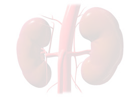

-**NH07
-**PARALLEL MINDS
# 🏥 Medical Report & Patient Management System  

  

<p align="center">
  
  
  
</p>

> A complete **Medical Report Generation & Patient Management System** with features like 3D visualization, chatbot assistance, patient summary reports, multilingual audio reports, and interactive dashboards.  

---

## ✨ Features  

- 📋 **Patient Report Generation** – Export in PDF, TXT formats  
- 🧑‍⚕️ **Doctor Support Module** – Manage and review reports  
- 🖼️ **3D Model Visualization** – Interactive scan visualization  
- 📊 **Dashboard & History** – Recent patient records and statistics  
- 🤖 **Chatbot Assistance** – Smart conversational support  
- 🔊 **Multilingual Audio Reports** – English & Telugu patient summaries  

---

## ⚙️ Requirements  

Install dependencies with:  

## Project Structure
├── app.py                 # Main Flask entry point
├── doctorreport.py        # Doctor report generator
├── patient_report.py      # Patient report handler
├── reportpatient.py       # Patient report processor
├── kidney_report.py       # Kidney report generation
├── templates/             # HTML pages (Frontend)
│   ├── index.html         # Home Page
│   ├── 3dmodel.html       # 3D Model Page
│   ├── dashboard.html     # Dashboard
│   ├── patientsview.html  # Recent Patients
│   ├── punlogin.html      # Chatbot UI
│   └── login.html         # Login Page
├── static/audio/          # Generated audio reports
│   ├── patient_english_report.mp3
│   └── patient_telugu_report.mp3
├── detection_results.json # Sample detection results
├── kidney_report.pdf      # Example kidney report
├── patient_Report.txt     # Example patient summary
├── scanned.jpg            # Example scanned image
├── speech.py              # Text-to-speech module
└── temp_bg.png            # Background / UI image

```bash
pip install flask reportlab pillow pandas numpy torch torchvision torchaudio scikit-learn ultralytics flask-cors opencv-python gTTS matplotlib

